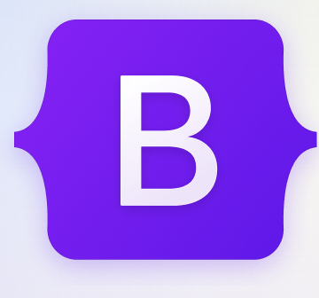
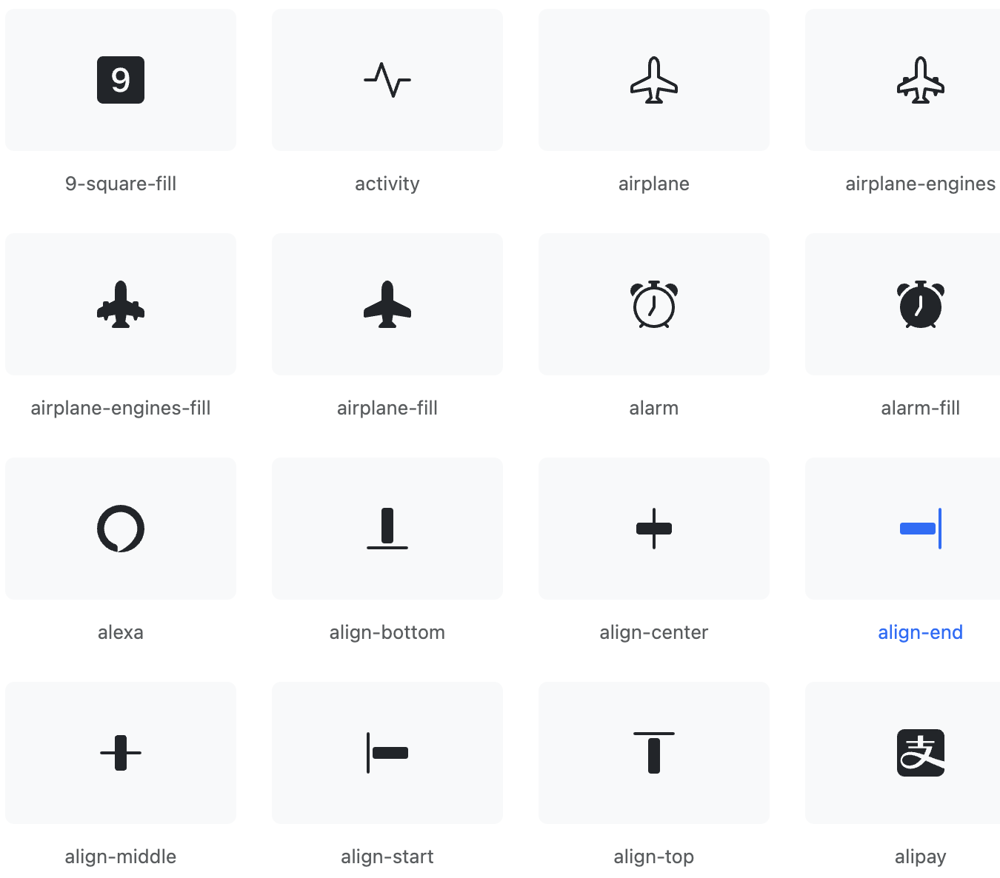

## Advantages of the UI framework

The UI framework makes it easier for new people to get started, with plenty of code and examples already available. Building a complete component library from scratch is a daunting task, and using a UI framework helps save time. The Bootstrap defines many CSS classes in advance. When using the Bootstrap, you can directly assign the class name to the `class`, such as `text-left`, `text-align`, and`.table`. The most representative class is the `btn` class. Bootstrap defines a basic class of `.bt`. If you want to have other styles, you can expand on this basic class to achieve different visual effects. And using UI frameworks can provide more popular, better-designed UI components. After investing time in learning and using Bootstrap 5, my programming ideas became more clear and direct. I was able to find the code I needed through many examples, so that I could more clearly create the web page I needed. Bootstrap 5 also has some common and beautiful icon designs, which can greatly reduce the time we spend searching and designing icons.

## Disadvantages of the UI framework

The downside of the UI framework is its compatibility and time commitment. There are plenty of examples of UI frameworks out there, but it takes time to memorize how to use them properly. It's not easy, it's almost like learning a new programming language. If you have your own special needs, you need to re-style, and if you have a site with a lot of non-bootstrap "style" styles, you need to do a lot of CSS rewriting, and therefore lose the point of using a framework. In terms of compatibility, it can cause slow loading and affect the user experience.

```<meta name="viewport" content="width=device-width, initial-scale=1">
<link href="https://cdn.jsdelivr.net/npm/bootstrap@5.2.0/dist/css/bootstrap.min.css" rel="stylesheet">
<script src="https://cdn.jsdelivr.net/npm/bootstrap@5.2.0/dist/js/bootstrap.bundle.min.js"></script>
```
Because you have to load these.

## Conclusion
In general, the UI framework is a great way to help us with page authoring. Learning the UI framework was definitely fun. It's a lifesaver for people like me who are not good at styling pages.



