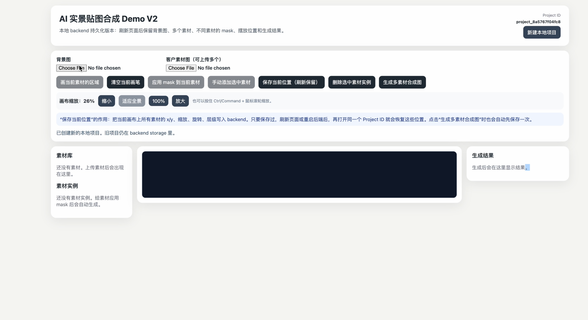

# AI-Assisted Real-Scene Visual Composition Platform



A full-stack visual composition platform that allows users to upload real-world scene images, upload multiple custom design assets, define asset-specific placement regions, and generate realistic multi-asset composite images.

This project is designed for controlled real-scene visualization workflows such as landscape design previews, outdoor installation mockups, architectural concept presentations, and client-facing design proposals.

Unlike fully generative image tools that may create unpredictable objects, this platform focuses on a controllable workflow: users provide the background image, users provide the assets, and users define where each asset should be placed.

---

## Project Overview

The goal of this project is to build a practical image composition system that helps users visualize how custom design assets would look inside real-world environments.

A typical use case is:

1. A user uploads a real outdoor scene photo.
2. The user uploads one or more custom assets, such as gazebos, landscape structures, signs, furniture, or product mockups.
3. The user selects an asset and draws one or more placement regions on the background image.
4. The system automatically places the selected asset into those regions.
5. The user can manually adjust the position, scale, and rotation of each inserted asset.
6. The backend generates a final composite image containing all visible assets.

The current version is a local-first full-stack implementation with project persistence, multi-asset support, per-asset masks, canvas editing, and backend image composition.

---

## Key Features

### Local Project Persistence

The application supports project-based local persistence through the backend.

Users can refresh the browser or restart both the frontend and backend, and the project can still be restored using the saved project ID.

Persisted data includes:

- Background image
- Uploaded asset images
- Asset-specific masks
- Asset placements
- Position, scale, rotation, visibility, and layer order
- Generated composite results

The frontend stores only the active `project_id` in browser localStorage. The backend stores all project files and metadata locally.

---

### Background Image Upload

Users can upload a real-world scene photo as the base image.

The uploaded background is saved in the backend project directory and restored automatically when the project is reloaded.

---

### Multi-Asset Upload

Users can upload multiple asset images without replacing previous uploads.

Each uploaded asset is stored as part of the project and can be reused multiple times on the canvas.

Supported asset use cases include:

- Landscape structures
- Gazebos
- Furniture
- Outdoor installations
- Signage
- Product mockups
- Design elements

---

### Per-Asset Mask Workflow

Each asset can have its own placement mask.

This allows different assets to be placed in different regions of the same background image.

Example workflow:

1. Select Asset A.
2. Draw several placement regions on the background.
3. Apply the mask to Asset A.
4. Asset A is automatically inserted into those regions.
5. Clear the temporary drawing layer.
6. Select Asset B.
7. Draw different placement regions.
8. Apply the mask to Asset B.
9. Asset B is inserted into its own regions.

This workflow makes it possible to control where each type of object appears independently.

---

### Automatic Placement Generation

When a user applies a mask to a selected asset, the system analyzes the drawn regions and automatically creates asset placements.

This allows users to quickly place the same asset in multiple areas without manually duplicating and positioning every instance.

---

### Multi-Asset Canvas Editing

After assets are inserted, users can manually adjust each asset on the canvas.

Supported editing operations include:

- Move asset placement
- Scale asset placement
- Rotate asset placement
- Delete a specific placement
- Preserve other placements after deletion
- Save current layout
- Restore layout after browser refresh

Each placement is stored independently, so deleting or editing one placement does not affect other assets.

---

### Multi-Asset Image Composition

The backend generates a final composite image using all visible asset placements.

The image composition pipeline reads the saved project state, loads the background image, loads all active asset placements, applies transformations, and renders the final result.

The current version prioritizes controllability and predictable output over fully generative image editing.

---

### Canvas Zoom and Full-Scene Viewing

The editor includes zoom controls for working with large or panoramic background images.

Supported controls include:

- Zoom in
- Zoom out
- Fit to view
- Reset to 100%
- Ctrl / Command + mouse wheel zoom

This makes it easier to work with wide background images without relying only on horizontal scrolling.

---

## Tech Stack

### Frontend

- React
- TypeScript
- Vite
- HTML Canvas-based editing workflow
- CSS

### Backend

- Python
- FastAPI
- Uvicorn
- Pillow
- OpenCV
- NumPy
- Pydantic

### Storage

The current version uses local file-system storage.

No cloud storage, database, or account system is required for the current implementation.

Future versions can replace local storage with:

- PostgreSQL
- AWS S3
- Cloudflare R2
- Google Cloud Storage

---

## System Architecture

```text
Frontend
React + TypeScript
Canvas editor, upload UI, mask drawing, asset placement, result preview

        ↓ HTTP API

Backend
FastAPI
Project creation, upload handling, project state management, local persistence

        ↓

Image Processing Engine
Pillow / OpenCV
Asset transformation, multi-asset rendering, image compositing

        ↓

Local File Storage
Project metadata, background images, asset images, masks, generated results
```


The project.json file stores the full project state.

## Core Workflow
1. Create or restore a local project
2. Upload a background image
3. Upload multiple custom asset images
4. Select one asset from the asset list
5. Draw placement regions for the selected asset
6. Apply the mask to generate asset placements
7. Repeat the process for other assets
8. Move, scale, or rotate individual placements
9. Save the current layout
10. Generate the final multi-asset composite image

## API Overview
### Project APIs

```
POST /api/projects`
GET /api/projects/{project_id}
```
### Background Upload

```
POST /api/projects/{project_id}/background
```
### Asset Upload

```
POST /api/projects/{project_id}/assets
```
### Asset Mask

```
POST /api/projects/{project_id}/asset-masks
```
### Placement Management

```
POST /api/projects/{project_id}/placements
PUT /api/projects/{project_id}/placements
DELETE /api/projects/{project_id}/placements/{placement_id}
```
### Image Composition

```
POST /api/projects/{project_id}/compose
```

## How to Run Locally
### Backend Setup

```
cd backend
python3 -m venv .venv
source .venv/bin/activate
pip install -r requirements.txt
uvicorn app.main:app --reload --port 8000
```

### Frontend Setup
Open a second terminal:

```
cd frontend
npm install
npm run dev
```

## Usage Guide
- Open the frontend page.
- Upload a background image.
- Upload one or more asset images.
- Select an asset from the asset list.
- Enable drawing mode for the selected asset.
- Draw one or more regions on the background image.
- Apply the mask to the selected asset.
- The selected asset will appear in the drawn regions.
- Repeat the process for additional assets.
- Adjust each placement by moving, scaling, or rotating it.
- Save the current layout.
- Generate the final multi-asset composite image.
- Preview the generated result.

## Current Implementation Status

The current version supports:

- Local project creation and restoration
- Background image upload
- Multiple asset uploads
- Per-asset mask drawing
- Automatic placement generation
- Multi-asset canvas editing
- Position, scale, rotation, and layer persistence
- Refresh recovery
- Backend/frontend restart recovery
- Multi-asset composite image generation
- Canvas zoom controls

## Current Limitations

The current version does not yet include:

- User authentication
- Cloud storage
- Database persistence
- Team collaboration
- Production deployment
- Advanced perspective correction
- AI-based inpainting
- AI-based lighting correction
- Permission management
- Version history dashboard

## Future Improvements

Planned improvements include:

- PostgreSQL integration
- AWS S3 or Cloudflare R2 storage
- User account system
- Project dashboard
- Team collaboration
- AI-assisted edge blending
- AI-based shadow and lighting refinement
- Perspective transformation controls
- Exportable client reports
- Deployment with Docker
- Production environment configuration
- Automated testing pipeline

## Skills Demonstrated
- Python
- FastAPI
- React
- TypeScript
- REST API development
- Image processing
- File-system persistence
- Canvas interaction
- State management
- Full-stack debugging
- Product design thinking
- Software architecture
- Git and GitHub workflow