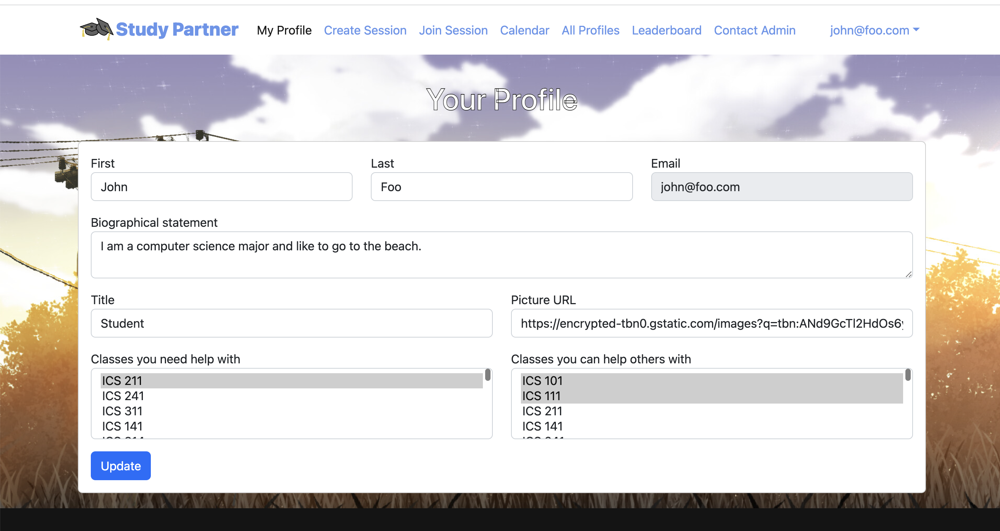
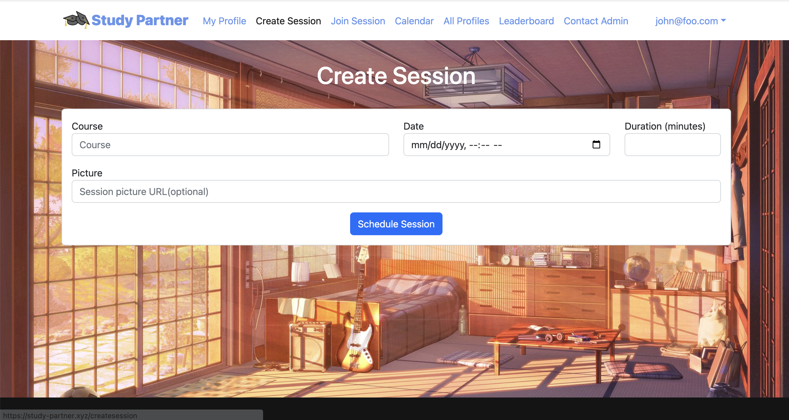
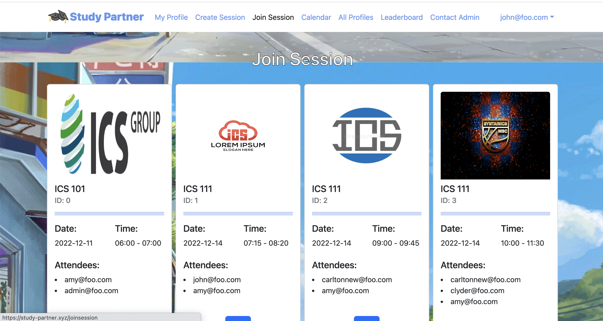
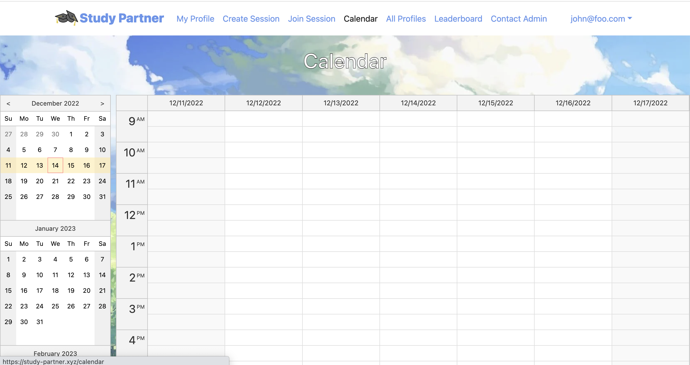
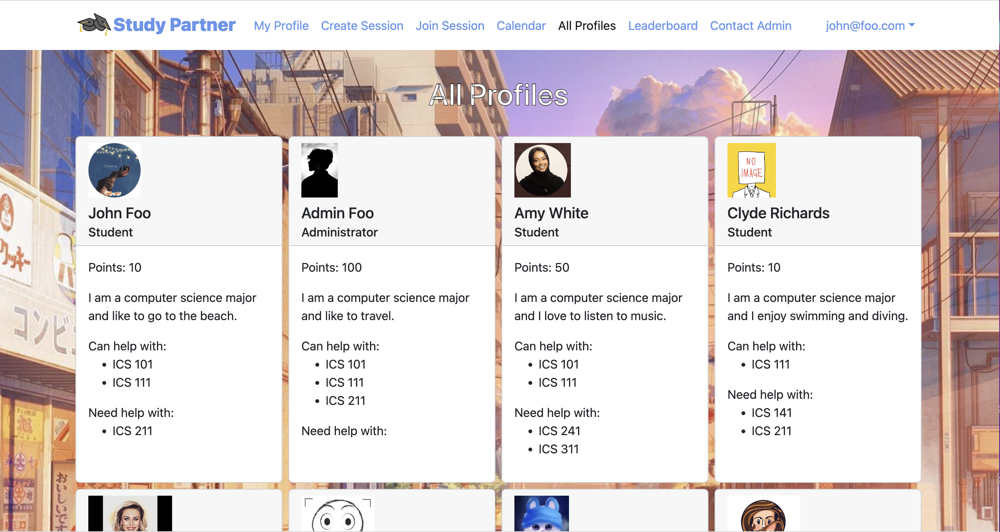
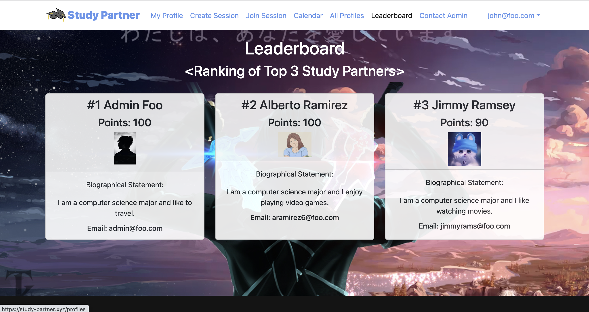

# Study-Partner
* [Project Overview](#overview)
* [Project Contribution](#project-contribution)
* [Learning](#knowledge-learning)
* [Details](#details)

## Overview

Study Partner is an application for UHM ICS students to self-organize face-to-face study groups around a course and/or specific homework or project topic.

     

ICS students can log in their personal information and the courses they need help with, or are able to help with. They can get or give more help to other students by creating or joining a session. And the sessions they join will be displayed on the calendar page for easier viewing with students. In addition, we also designed a score panel, where students can get scores by joining or creating meetings. The three students with the highest score will be displayed on the page of the leader board. Students are free to choose the images on their profile page and session page. When students need any help or encounter various problems, they can contact us through the contact admin page, and we will try our best to provide the necessary help.

Study Partner can be used as a development template for developers to use.

The Study Partner has been deployed on the Digital Ocean.

Deployed application can be found at [https://study-partner.xyz/](https://study-partner.xyz/)

All pages are via testcafe.

```
$ meteor npm run testcafe-ci

> study-partner@ testcafe-ci /Users/feiyichen/github/study-partner/study-partner/app
> testcafe chrome:headless tests/*.testcafe.js -q --app "meteor npm run start"

 Running tests in:
 - Chrome 86.0.4240.111 / macOS 10.15.7

 study-partner localhost test with default db
 ✓ Test that landing page shows up
 ✓ Test that signin and signout work
 ✓ Test that signup page, then logout works
 ✓ Test that profiles page displays
 ✓ Test that profile page display and profile modification works
 ✓ Test that calendar page works
 ✓ Test that contact admin page works
 ✓ Test that admin view reports works
 ✓ Test that the home page displays
 ✓ Test that leaderboard works
 ✓ Test that join session page displays
 ✓ Test that create session page works


 12 passed (2m 52s)

$
```
## Project Contribution

In this project, a total of five members of our team helped and communicated with each other to complete the project.

Among these, my main contribution is the development of Join Session Page and Create Session Page. As well as participate in default database modification, application deployment and home page editing.

Detailed task assignment can be seen:
* [Milestone 1](https://github.com/orgs/study-partner/projects/1)
* [Milestone 2](https://github.com/orgs/study-partner/projects/2)
* [Milestone 3](https://github.com/orgs/study-partner/projects/3)

## Knowledge Learning

In this project, I can mainly apply the basic development knowledge of software engineering. Learn to use HTML and JSX coding knowledge and database connection. And test my page with Testcafe. Along the way, I also learned how to deploy my applications on the site and update them.

## Details
More details can be found on our [app homepage](https://study-partner.github.io/).
